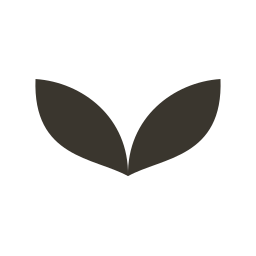

# Bunny Developer Org — brand assets

The org mark: two soft, asymmetric blades leaning into an ear silhouette. One color, no gradients, no literal bunny illustration.

## Files

| Path | What it's for |
|---|---|
| `logo-light.svg` | Master vector, ink fill, transparent background. Use this for anything that can render SVG. |
| `logo-dark.svg` | Same mark in cream, for dark backgrounds. |
| `png/logo-light-{1024,512,256,128,64,32}.png` | Ink-on-transparent raster, for tools that don't take SVG. |
| `png/logo-dark-{1024,512,256,128,64,32}.png` | Cream-on-transparent raster, for dark surfaces. |
| `avatar/github-avatar-light.png` | 512×512, opaque cream background, mark sized inside a circular-safe zone. Use this to set the org's GitHub avatar. |
| `avatar/github-avatar-dark.png` | Same, opaque ink background, cream mark — for places that composite the avatar on dark chrome. |
| `favicon-32.png`, `favicon-16.png` | Opaque cream background, for browser tabs on org sites (e.g. a docs site or status page). |

## Color

- Ink (mark, light backgrounds): `#3A362E`
- Cream (mark, dark backgrounds): `#F1EBDC`
- Cream (background, light avatar/favicon): `#F7F2E9`

Single color only. Don't recolor the mark to match a per-project accent — that's what distinguishes the org identity from any one app's icon (several of which use this same blade shape with their own palette).

## Clear space & minimum size

Keep clear space around the mark equal to at least the width of one blade (roughly 20% of the mark's overall width) on every side before any other element — text, a card edge, another logo.

Don't go below 24px for the raster PNGs or the blade tips start to lose their curve. The SVGs scale losslessly, so prefer those whenever the destination supports vectors.

## Backgrounds

- On light/cream surfaces: use `logo-light.svg` (ink).
- On dark surfaces: use `logo-dark.svg` (cream).
- Don't place either transparent version directly on a busy photo or a mid-tone background where neither version has enough contrast — use one of the opaque avatar files instead, which carry their own background.

## Per-app assets

Assets specific to one app (not the shared org mark) live under `apps/<app-name>/`.

| Path | What it's for |
|---|---|
| `apps/vane-bunny/play-developer-header.png` | 4096×2304, 24-bit PNG, no alpha, 176KB. Vane Bunny's Google Play developer header image (uses that app's own three-wing icon + wordmark, not the shared org mark). |

## Setting the GitHub org avatar

GitHub doesn't expose org-avatar upload over the API in a way that's safe to script unattended, so this is a manual step:

1. Go to `https://github.com/organizations/Bunny-Developer-Org/settings/profile`
2. Under "Organization avatar," upload `avatar/github-avatar-light.png`
3. Save.

## Don't

- Don't stretch or skew the mark to fit a non-square space — pad with clear space instead.
- Don't add a drop shadow, outline, or gradient to the mark itself.
- Don't rotate it — the lean of the two blades is fixed.
